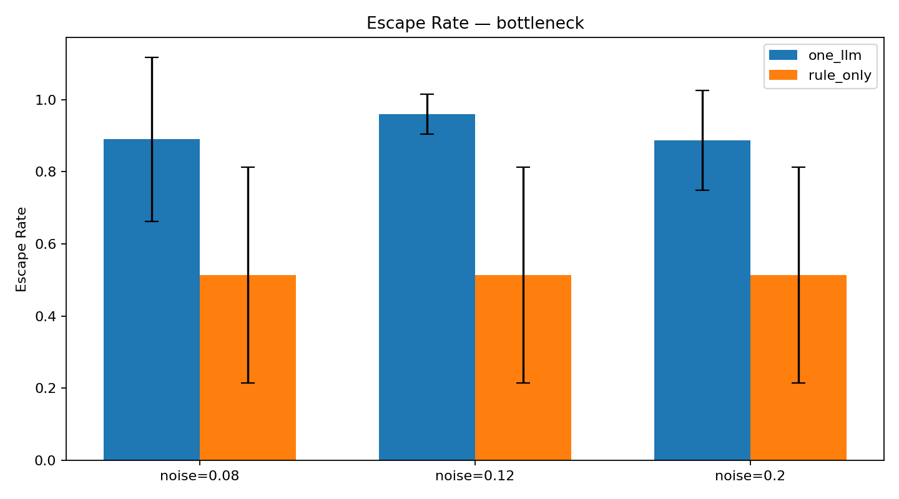
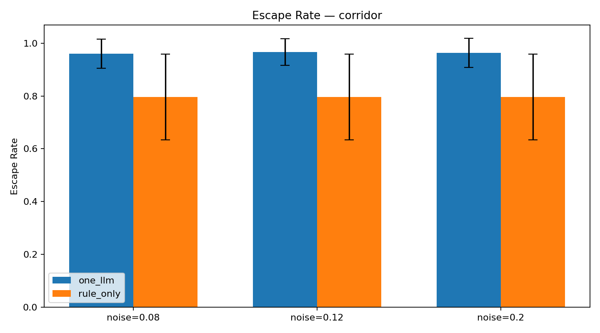
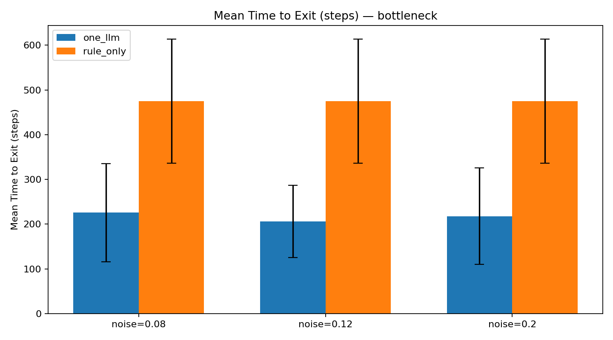
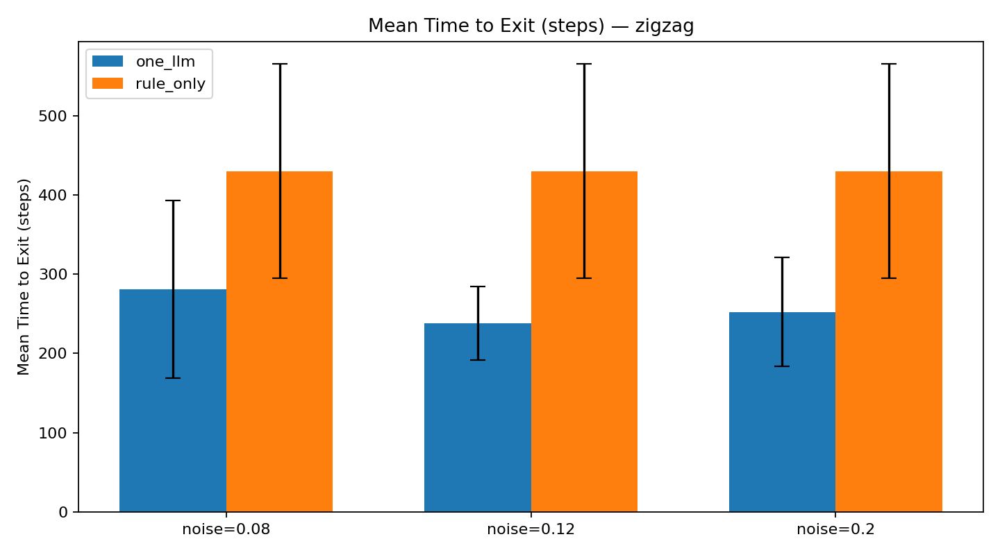
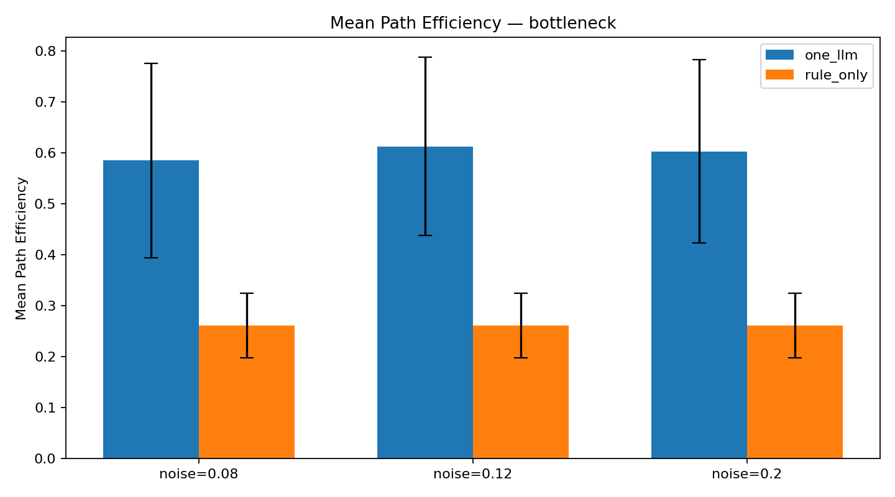
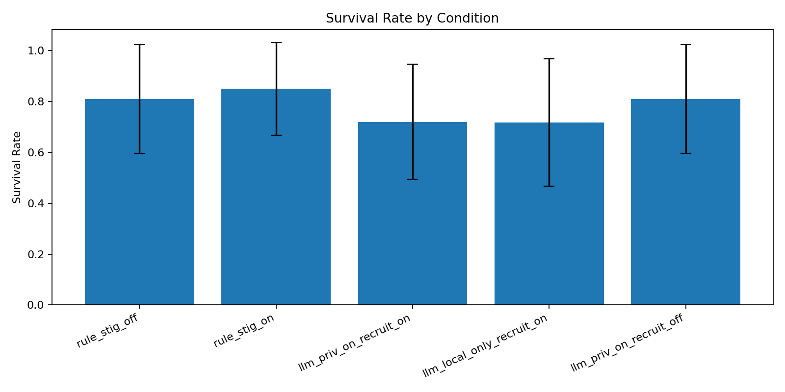
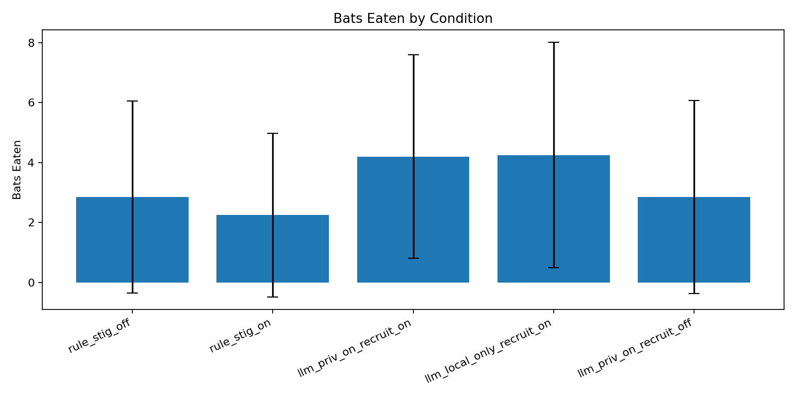
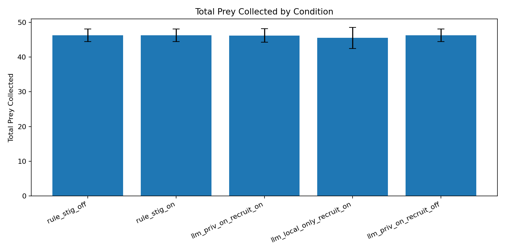
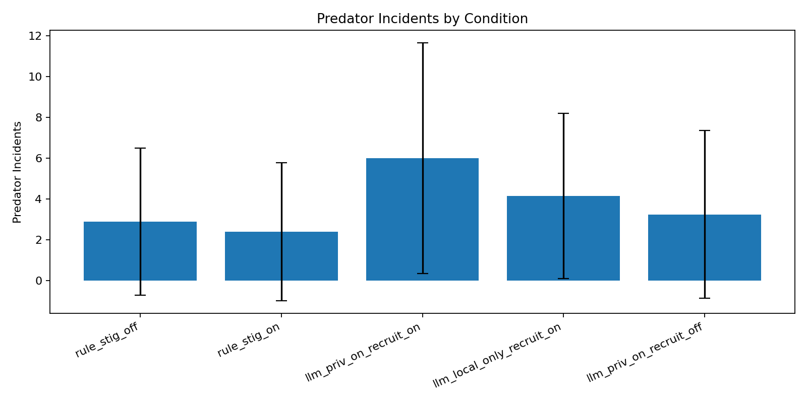

# LLM-Augmented Stigmergy: Embedding a Language Model Agent in a Bio-Inspired Bat Swarm

**Authors:** Joel Carlson, Yuri Fung  
**Course:** CSCI 5423, Biologically Inspired Computing

---

## 1. Introduction

Swarm intelligence emerges when many simple agents follow local rules and coordinate through their shared environment. This principle is called *stigmergy*. Ant colonies build complex structures, fish schools evade predators, and bat colonies locate prey without any individual agent having a full global view of the world. These systems are robust and scalable, but they also have clear limits. Purely rule-based agents often struggle with novel situations, changing goals, and ambiguous sensory input.

Large language models, or LLMs, have recently shown strong reasoning ability in agent settings. This raises a natural question: can a single LLM-controlled agent improve the performance of a rule-based swarm by acting as an informed individual?

This paper presents a simulation study of LLM-augmented bat swarms in two tasks: cave exit navigation (Task 1) and open-world foraging with predator avoidance (Task 2). In both tasks, a single LLM bat operates alongside rule-based bats in a shared acoustic stigmergy environment. The LLM bat is powered by Qwen3.5-0.8B served locally through LM Studio. We show that the LLM bat substantially improves collective navigation performance in Task 1. In Task 2, the results are more mixed. The informed bat helps expose useful trade-offs between recruitment, safety, and foraging efficiency. Overall, the results support the informed-individual hypothesis of Couzin et al. (2005): a small minority with better information can influence group behavior through local motion decisions and shared acoustic signaling.

---

## 2. Background and Related Work

**Stigmergy.** Stigmergy describes indirect coordination through environmental modification. Ants deposit pheromones to mark food trails, and later ants follow and reinforce those trails. This produces collective foraging without any central controller. In our system, bats deposit acoustic signals into a shared soundscape. We model two channels: buzz for nearby prey and alarm for nearby predators. These signals decay and diffuse over time, so they function as a two-channel digital pheromone.

**Bat echolocation and social foraging.** Real bats use echolocation for both navigation and social coordination. Bohn et al. (2009) showed that bats eavesdrop on one another's feeding buzzes to locate prey. Group foraging can therefore emerge through passive acoustic coupling. This directly motivates our buzz and alarm design. Rule-based bats deposit and follow acoustic gradients in the same way that real bats exploit social acoustic cues.

**Informed individuals in animal groups.** Couzin et al. (2005) showed with an individual-based model that a small number of informed individuals can reliably steer an entire moving group toward a goal. They do not need to broadcast their identity to do so. Larger groups can often be guided by a smaller proportion of informed agents. This result is the theoretical foundation for our LLM bat design. We embed one agent with stronger reasoning ability into a swarm of 14 rule-based bats.

**LLMs as agents.** Recent work studies LLM-based multi-agent systems for collective decision-making, planning, and self-refinement. The most directly related example for our project is LLM2Swarm (Jürgen et al., 2024), which embeds LLMs into robot swarms for real-time reasoning and natural-language coordination. Our setting is different in two ways. First, we use a single LLM agent as an informed individual rather than giving every agent an LLM. Second, we study how the LLM's influence spreads through shared acoustic fields rather than direct language-based communication.

---

## 3. Methods

### 3.1 Simulation Environment

The simulation runs on a 220×110 discrete grid implemented in Python with Pygame. Two two-dimensional acoustic fields, *buzz* and *alarm*, form the stigmergy substrate. At each time step, the fields decay by a factor of 0.985 and diffuse at rate 0.18. This approximates how acoustic signals weaken and spread through space. Bats deposit signals into these fields by emitting calls, and they read from them through local gradient sensing.

Echolocation is modeled as eight-direction ray casting with configurable uniform noise in {0.08, 0.12, 0.20}. The system returns obstacle distances in each direction. All experiments use 15 bats total. In LLM conditions, there is 1 LLM bat and 14 rule-based bats. In control conditions, all 15 bats are rule-based.

### 3.2 Agent Types

**RuleBasedBat.** At each step, a rule-based bat evaluates neighboring cells with a weighted combination of local buzz signal, local alarm signal, and a task-specific bias. In Task 1, that bias encourages rightward progress toward the exit. In Task 2, it encourages exploration and prey seeking while avoiding risk. The bat emits a `BUZZ` call when prey-related cues are strong and an `ALARM` call when predator-related cues are strong. Movement is resolved with a priority-based collision system that reduces deadlocks.

**LLMBat.** Every 5 simulation steps, the LLM bat constructs a structured prompt that includes its current position, echolocation distances in eight directions, local buzz and alarm levels, and nearby bat positions. In privileged-observation conditions, the prompt also includes the bearing and distance to the nearest predator. The prompt instructs the LLM to return one directional action (`N`, `NE`, `E`, `SE`, `S`, `SW`, `W`, `NW`, or `STAY`) and one social call (`BUZZ`, `ALARM`, or `NONE`) with a brief rationale. Between LLM queries, the bat repeats its most recent decision. The model used is Qwen3.5-0.8B in GGUF format, served locally at `127.0.0.1:1234` through LM Studio with temperature 0.2.

When the LLM bat emits a `BUZZ` call, it recruits nearby hungry bats within Manhattan distance 14 into a 30-step follow-leader mode. When it emits `ALARM`, it recruits nearby bats within distance 16 into a 24-step coordinated escape.

### 3.3 Task 1: Cave Exit Navigation

Bats spawn in a procedurally generated cave and must reach an exit region on the right side of the grid. Four cave layouts are tested: *corridor* for a basic passage, *bottleneck* for a narrow chokepoint, *zigzag* for a winding path, and *cul-de-sac* for a dead-end branch that requires backtracking. The task ends when all bats escape or when 1000 steps elapse.

**Experimental design:** 4 layouts × 3 noise levels × 2 conditions (rule-only, one-LLM) × 20 random seeds = 480 episodes.

**Metrics:** escape rate, mean time to exit, path efficiency, and jam events. Escape rate is the fraction of bats that reach the exit. Mean time to exit is measured in simulation steps. Path efficiency is computed as net rightward progress divided by total path length. Jam events count multi-step stuck episodes per bat.

### 3.4 Task 2: Open-World Foraging

Bats operate in a toroidal open world with 50 prey items and 3 roaming predators. Prey are captured within a small radius. Predators kill bats that enter their kill zone. The task ends when all prey are collected, all bats are dead, or 700 steps elapse.

Five conditions are compared:

| Condition | LLM Bats | Stigmergy | Privileged Obs | Recruitment |
|---|---|---|---|---|
| rule_stig_off | 0 | Off | N/A | Off |
| rule_stig_on | 0 | On | N/A | Off |
| llm_priv_on_recruit_on | 1 | On | Yes | On |
| llm_local_only_recruit_on | 1 | On | No | On |
| llm_priv_on_recruit_off | 1 | On | Yes | Off |

**Metrics:** total prey collected, survival rate, bats eaten, predator incidents, time to first prey, time to all prey, and zero-death episode rate.

All conditions run across 20 random seeds, for a total of 100 episodes.

---

## 4. Results

### 4.1 Task 1: Cave Exit Navigation

Adding a single LLM bat produced consistent improvements in collective navigation performance across all four cave layouts and all tested noise levels.

**Escape rate.** Figure 1 shows escape rates by layout. The LLM condition improved escape rate in every layout. The largest gain occurred in the bottleneck layout, which is the most spatially constrained. Escape rate rose from 51% in the rule-only condition to 91% with one LLM bat. In the corridor, cul-de-sac, and zigzag layouts, escape rates improved from 80%, 79%, and 69% to 96%, 97%, and 90%, respectively.

*Figure 1a: Escape rate in the bottleneck layout by condition and noise level. Error bars show ±1 standard deviation across 20 seeds.*

*Figure 1b: Escape rate in the corridor layout.*

**Time to exit.** The LLM condition roughly halved the time required for bats to exit across layouts, as shown in Figure 2. In the bottleneck, mean exit time dropped from 475 to 216 steps. In the corridor, it dropped from 294 to 162 steps. This pattern is consistent with the LLM bat acting as a pathfinder that locates the exit early and deposits buzz signals that guide the swarm.

*Figure 2a: Mean time to exit in the bottleneck layout. Only episodes where at least one bat escaped are included.*

*Figure 2b: Mean time to exit in the zigzag layout.*

**Path efficiency.** LLM-guided swarms also produced more direct routes. In the bottleneck, path efficiency increased from 0.26 to 0.60. This suggests that the LLM bat finds the exit with less wandering and steers the swarm along a more direct path.

*Figure 3: Path efficiency in the bottleneck layout. Higher values indicate more direct routes to the exit.*

**Jam events.** The LLM condition showed a small but consistent increase in jam events. This is an expected trade-off. Routing more bats through narrow passages more quickly creates brief congestion, even though overall throughput and escape success improve.

### 4.2 Task 2: Open-World Foraging

Task 2 presents a more nuanced picture. Table 1 summarizes the key metrics across all five conditions.

| Condition | Prey Collected | Survival Rate | Bats Eaten | Pred. Incidents | Zero-Death Episodes |
|---|---|---|---|---|---|
| rule_stig_off | 46.25 | 0.81 | 2.85 | 2.90 | 0.40 |
| rule_stig_on | 46.25 | 0.85 | 2.25 | 2.40 | 0.50 |
| llm_priv_on_recruit_on | 46.20 | 0.72 | 4.20 | 6.00 | 0.20 |
| llm_local_only_recruit_on | 45.50 | 0.72 | 4.25 | 4.15 | 0.30 |
| llm_priv_on_recruit_off | 46.25 | 0.81 | 2.85 | 3.25 | 0.45 |

*Table 1: Task 2 condition summary, averaged across 20 seeds.*

**Stigmergy effect.** Comparing `rule_stig_off` to `rule_stig_on` shows that stigmergy alone modestly improves survival, from 0.81 to 0.85, and reduces bats eaten, from 2.85 to 2.25, without changing prey collection. The shared alarm field appears to help bats avoid predator zones.

**LLM recruitment as a double-edged sword.** The two conditions with LLM recruitment enabled show substantially lower survival, around 0.72, and more bats eaten, around 4.2. Figure 4 highlights this pattern.

*Figure 4: Survival rate by condition. LLM recruitment conditions, `llm_priv_on_recruit_on` and `llm_local_only_recruit_on`, show the lowest survival.*

*Figure 5: Mean bats eaten per episode. Recruitment conditions lose about 50% more bats than the rule-based baselines.*

Prey collection remains nearly identical across conditions, at roughly 46 prey out of 50. This means the LLM recruitment mechanism does not improve foraging yield. Instead, it appears to pull more bats into prey-rich areas that also overlap with predator patrol zones.

*Figure 6: Total prey collected per episode. All conditions collect similar amounts of prey regardless of LLM or stigmergy configuration.*

**Recruitment is the key variable.** The clearest evidence comes from comparing `llm_priv_on_recruit_on` to `llm_priv_on_recruit_off`. These two conditions are identical except for recruitment. When recruitment is disabled, survival returns to 0.81, which matches the rule-only baseline, and bats eaten drops to 2.85. This suggests that the main source of the survival cost is recruitment rather than the LLM's movement decisions or privileged observation.

*Figure 7: Predator incidents by condition. Privileged observation combined with recruitment, `llm_priv_on_recruit_on`, produces the highest predator encounter rate.*

---

## 5. Discussion

**Task 1.** Task 1 shows that a single LLM agent can act as an effective informed individual in a stigmergy-based swarm. The effect is strongest in the bottleneck layout, where rule-based bats struggle the most. The LLM bat can reason about the local geometry of the chokepoint, choose a useful direction, and deposit buzz signals that guide the swarm. This is a direct empirical example of the Couzin et al. (2005) informed-individual effect.

**Task 2.** Task 2 tells a more mixed story. The LLM bat is a capable forager and coordinator, but its `BUZZ` recruitment signal brings nearby bats into areas that are both prey-rich and dangerous. That is not necessarily irrational. It reflects a strategy that prioritizes food discovery and local coordination. However, the 0.8B model does not appear to balance prey opportunity and predator proximity well when issuing recruitment calls. A larger model, or a fine-tuned model, might learn to make more selective recruitment decisions. The key result here is that disabling recruitment restores near-baseline survival without hurting prey collection much. That suggests the LLM's directional movement is often reasonable, while the broadcast recruitment behavior is the main source of risk.

**Limitations.** The LLM, Qwen3.5-0.8B, is small compared with frontier models and has no memory across episodes. The prompt format is fixed. It does not adapt to earlier failures or successes. The batch evaluation is headless, so it may not perfectly match the timing and qualitative dynamics of the interactive simulation.

**Future work.** Future work could explore larger models, fine-tuning on simulation traces, multiple informed agents with different roles, and adaptive recruitment that conditions more explicitly on predator proximity.

---

## 6. Project Contributions

- **Yuri Fung:** Led the full implementation of the simulator, including the rule-based and LLM bat agents, cave and open-world environments, predator and prey logic, batch evaluation scripts, analysis scripts, GIF and MP4 generation, and the core experimental pipeline.
- **Joel Carlson:** Prepared the presentation slides and wrote most of the report draft.

---

## 7. Bibliography

Couzin, I.D., Krause, J., Franks, N.R., & Levin, S.A. (2005). Effective leadership and decision-making in animal groups on the move. *Nature*, 433, 513–516. https://www.nature.com/articles/nature03236

Bohn, K.M., Moss, C.F., & Wilkinson, G.S. (2009). Experimental evidence for group hunting via eavesdropping in echolocating bats. *Proceedings of the Royal Society B*. https://pmc.ncbi.nlm.nih.gov/articles/PMC2839959/

Jürgen, S., et al. (2024). LLM2Swarm: Robot Swarms that Responsively Reason, Plan, and Collaborate through LLMs. *arXiv:2410.11387*. https://arxiv.org/html/2410.11387v2

---

## 8. Videos and Code Repository

Simulation video: [Task 2 Video](https://youtu.be/HDPGYy7S6OE)

Code repository: [LLM-Augmented Stigmergy GitHub](https://github.com/SUPERINTIALD/CSCI_5423_Bio_Final_Project)
